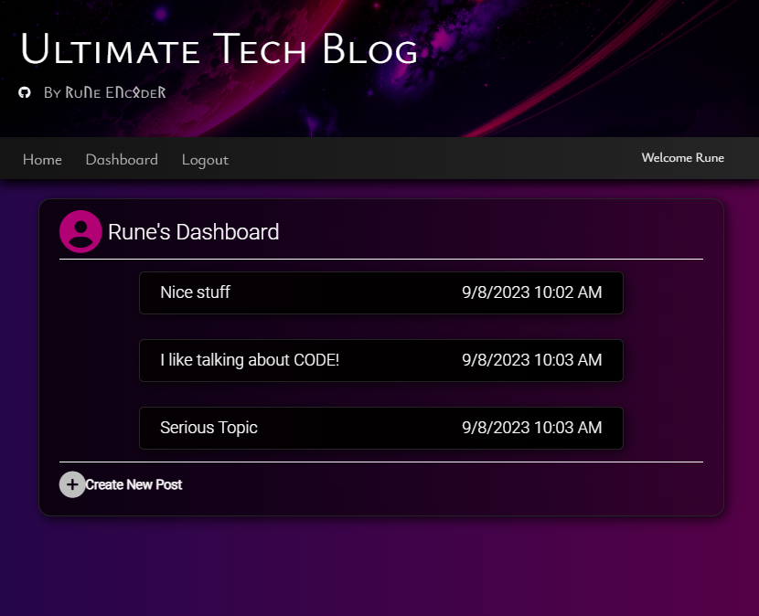

# Ultimate Tech Blog  

 ## Description
 
  **Ultimate Tech Blog Deployed Application: [Ultimate Tech Blog]()** 
  
>**Application Preview:**  
 
 
 ## Table of Contents
 
 - [Installation](#installation)
 - [Usage](#usage)
 - [Contribution](#contribution)
 - [Tests](#tests)
 - [License](#license)
 - [Questions](#Questions)

 ## Installation
 
 **Before using this application, you will need to install:**  

 
 ## Usage
 
 ## Contributing
 
 Created by: Christian Palacios
 
 To contribute to this repository you may contact me for further details.  
 Contact details below in the Questions Section.
 
 ## Tests
 
**Testing API routes was done using Insomnia.**  

**Testing Preview:**  

 

 ## Credits

 Used CSS glass template from: https://css.glass
 
 ## License

   
 **The MIT License**  
 Please refer to the LICENSE in the repository.

 ## Questions
 
 **If you have any questions you may reach me at my email: [cont_rune_encoder@outlook.com](mailto:cont_rune_encoder@outlook.com)**  

 **Here is a link to my Github Profile: [Profile Link: rune-encoder](https://github.com/rune-encoder)**  

 **If you would like to check out my other projects visit this link: [Projects Link: rune-encoder](https://github.com/rune-encoder?tab=repositories)**

  ## Screenshots
 
>**Application Homepage:**  
 

>**Application Dashboard:**  

>**Create Post:**  
 

>**Edit Post:**  
 

>**Add Comment:**  
 

>**Redirect:**  
 
